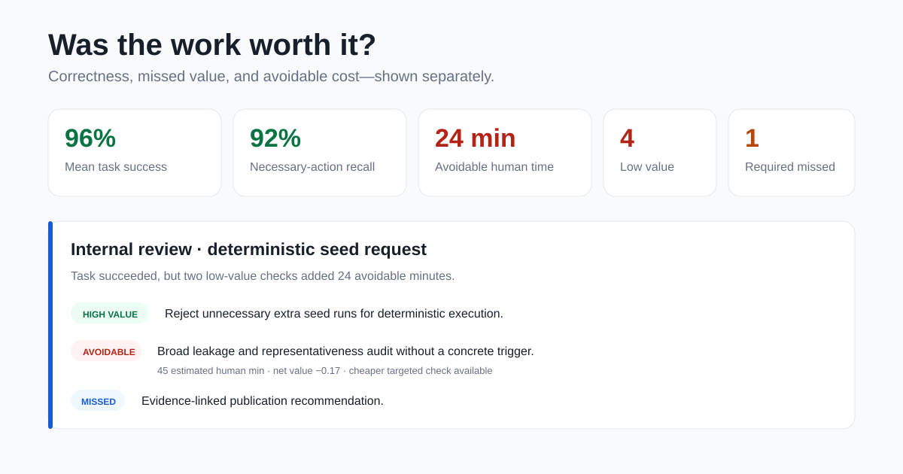

# Growing Bench: Worth It

**Correct isn't enough. Was the work worth it?**

Growing Bench evaluates whether an Agent completed the real task and whether its work justified the time, scope, and interaction cost.

Ask a coding Agent for a small, bounded change. The tests pass. The same trajectory may also contain a SHA 256 manifest nobody requested, an audit of unrelated files, recovery machinery for a disposable fixture, and forty minutes of work that never changed the outcome.

Ask a writing Agent to polish a README. It may replace a clear claim with paragraphs explaining what the project does not prove, cannot establish, and should never be used for. That happened while we were preparing this repository.

Growing Bench makes those experiences executable. Each task gives an Agent a disposable Git repository or LaTeX project. The Agent reads files, edits the workspace, runs checks, and leaves a visible trajectory. The evaluator then asks two questions:

1. Did the Agent accomplish the task?
2. Which actions created value, wasted effort, or missed something important?



## Try it in two minutes

```bash
git clone https://github.com/Takamatsu-Hikaru/Growing-Bench-Worth-It.git
cd Growing-Bench-Worth-It
python -m pip install -e .
growing-bench smoke --output runs/first-look
```

The smoke command runs offline. It loads scored examples, executes a real disposable workspace task, records the trajectory, and generates static HTML reports.

To inspect your environment:

```bash
growing-bench doctor
```

## What you get

Growing Bench ships 50 workspace tasks across 25 scenario families:

| Context | Tasks | What the Agent works on |
|---|---:|---|
| Code | 14 | Executable repositories |
| Writing | 12 | LaTeX and document projects |
| Internal review | 12 | Evidence packages and decision artifacts |
| External peer review | 12 | Papers, evidence, and review forms |

Every task has a disposable fixture, observable completion checks, an allowed modification scope, a reference implementation, and known wrong solutions. The tasks include matched situations where extra caution is valuable and nearby situations where the same behavior becomes wasteful.

## Read the work, not just the answer

Each run preserves:

* the task and disposable workspace
* visible Agent messages and tool events
* file edits and changed paths
* checks before and after the run
* timing and interaction events
* a normalized action timeline
* evidence for each scored action

The report keeps the useful signals separate:

* task success
* necessary action recall
* missed high value actions
* avoidable actions
* avoidable time and interaction burden
* cheaper available substitutes
* trajectory value and ROI

Actions appear as `necessary / efficient`, `necessary / expensive`, `avoidable`, `optional / conditional`, `proposed, not executed`, `failed / reverted`, `missed`, or `unresolved`. ROI summarizes the tradeoff while the action timeline shows why the number moved.

## Run your Agent or skill

```bash
growing-bench run tracks/workspace-v0.2/tasks/<task-id>/task.json \
  --agent codex --output runs/codex-1

growing-bench run tracks/workspace-v0.2/tasks/<task-id>/task.json \
  --agent claude-code \
  --intervention path/to/SKILL.md \
  --output runs/claude-with-skill

growing-bench report data/releases/workspace-v0.2-calibration
```

Built in adapters support Codex, Claude Code, OpenClaw, and arbitrary command line Agents. Every run starts from a fresh fixture copy. Growing Bench owns workspace isolation, completion checks, allowed path enforcement, trajectory normalization, judging, and reporting.

Adapter contracts and recorded event examples are documented in [docs/AGENT_ADAPTERS.md](docs/AGENT_ADAPTERS.md).

## Compare an intervention

The same task can be run with a baseline Agent and with a prompt, skill, plugin, or harness intervention. The report compares outcome quality and trajectory quality together.

Useful interventions should improve the balance:

* preserve task success
* recover necessary actions
* reduce avoidable work
* avoid needless escalation
* spend user attention where it can change the result

This makes Growing Bench useful as a regression suite during Agent development. A new model can close one frustrating behavior and introduce another. Each behavior can become a versioned track with its own tasks and evaluation contract.

## Add a real failure case

Start with the experience you actually had:

```bash
growing-bench init-case my-frustrating-case
```

Put the initial repository or LaTeX project in `fixture/`, add the minimal expected change in `reference/`, then check the case:

```bash
growing-bench ingest my-frustrating-case/case.md --check
```

The preflight checks whether the goal is observable, the fixture can run, publication permission is clear, the case overlaps an existing task, and a useful matched counterpart can be built.

Materialize the case after curation:

```bash
growing-bench ingest my-frustrating-case/case.md \
  --materialize \
  --validate \
  --curation my-frustrating-case/curation.ai.json
```

The included example at `living/contributions/cli-slug-helper/` demonstrates the full path from a Markdown experience to a versioned workspace track, Agent trajectory, AI consensus judgment, score, and report.

## Main commands

```text
growing-bench run       run a workspace task
growing-bench judge     score an existing trajectory
growing-bench report    generate a static HTML report
growing-bench ingest    add a portable case
growing-bench smoke     run the offline product tour
growing-bench doctor    inspect the local installation
```

## Contribute

Good cases come from concrete moments when an Agent passed the obvious check yet still made the work worse, or when restraint would have caused a real failure. Bring the smallest reproducible workspace that preserves the decision.

See [CONTRIBUTING.md](CONTRIBUTING.md) for the case format and adapter contract.

MIT licensed.
